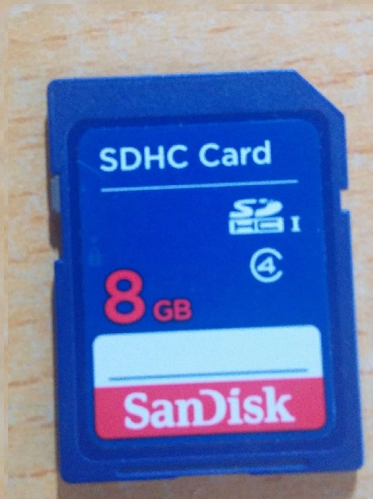
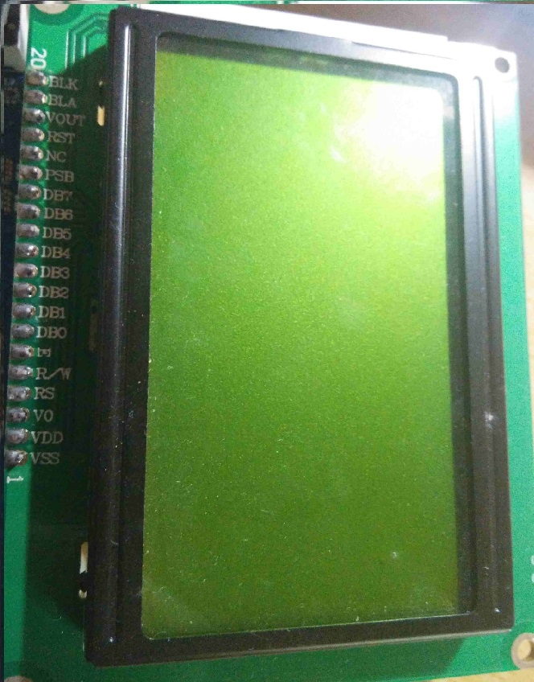
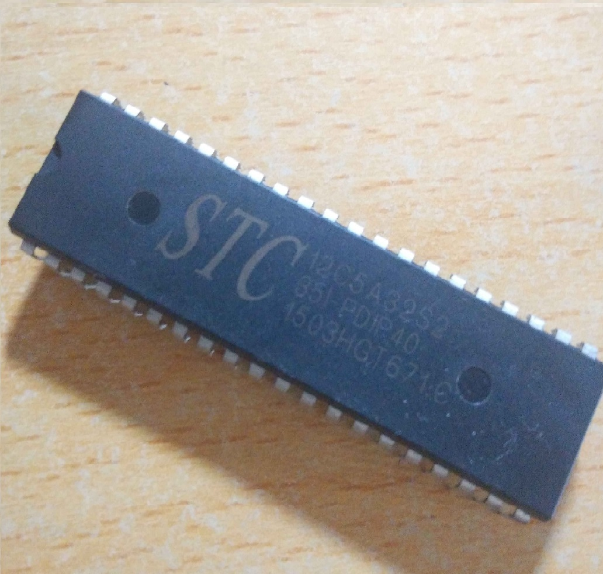
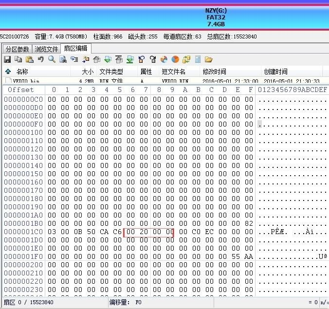

# SD_FAT32
大学时期的娱乐项目，使用在51单片机上运行的FAT32文件系统读取8GSD卡内的bin文件，传输至LCD12864上播放视频
## 硬件简介

## 测试方式
51单片机FAT32文件系统读取 8G SD卡的视频数据，传输至 LCD12864 上播放视频
## 项目描述
1. 文件系统只支持FAT32，不过增添了DBR扇区查找函数，以便跳过SD卡的隐藏扇区
2. LCD选用的是基于ST7920的LCD12864
3. SD卡SPI模式是由IO口模拟SPI驱动
4.SD卡驱动支持SDHC，用8G SD卡测试过，更高容量的没有试过
## 流程简介
1. 初始FAT32文件系统
2. 打开指定路径的FAT文件
3. 文件名转换
4. 打开目录并匹配目录的文件
5. 确认目录的内容
6. 按顺序读出簇链上的扇区
## SD卡DBR扇区查找
如图为SD卡物理0扇区主引导扇区MBR

MBR由446个字节的引导代码、64个字节的主分区（4个）表及两个字节的签名值“55AA”组成。
不知道为什么SD卡的前446字节全是0，可能是由于SD卡不存在系统引导问题吧，另外声明一下，我的8G SD卡是在windows操作系统格式化为FAT32文件系统的。

这里主要关注的是我用红框围起来的4个字节的值 00 00 20 00 （读的顺序按照大端小端），这个值就是文件系统开始的物理扇区号，把十六进制0X2000转换为十进制就是8192，也就是说文件系统开始的物理扇区号是8192，如下图:

